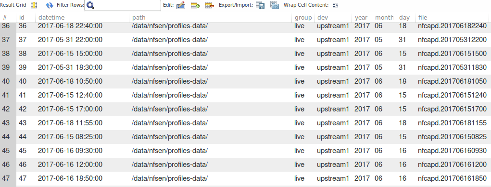

## NFDUMP Scan Folders to DB

This application scan files names in structure NfSen folders and transfer in to db.

### Install
* Install NfSen, with default settings. Link - http://nfsen.sourceforge.net,
* Install MySQL.
* Install dependency packages from import to `main.go`,
* Make changes to `config.yml`,
* Run `$go run main.go`.

### Example
Table pic.

P.S. - What are the suggestions for developing this application?